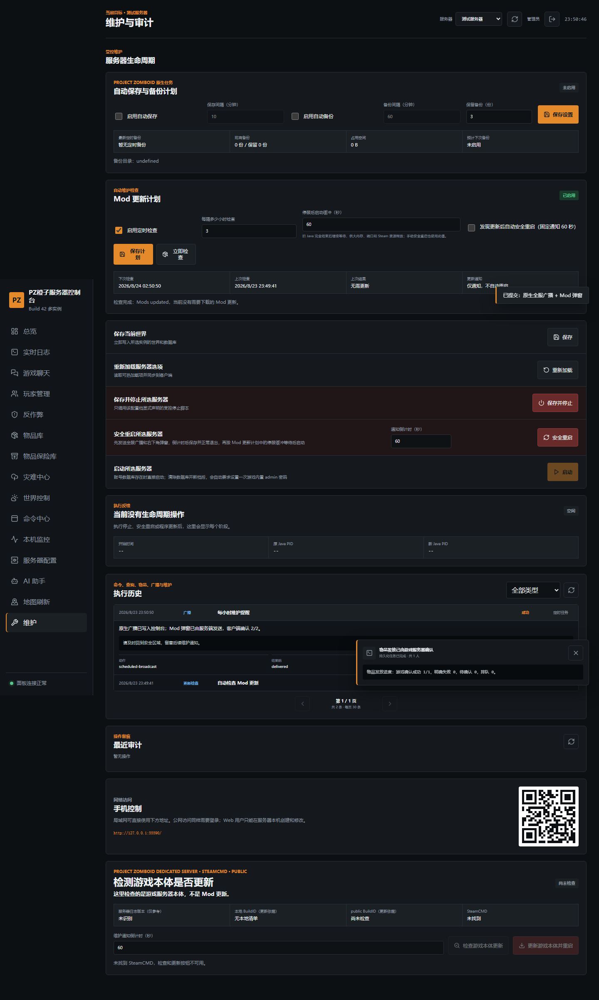
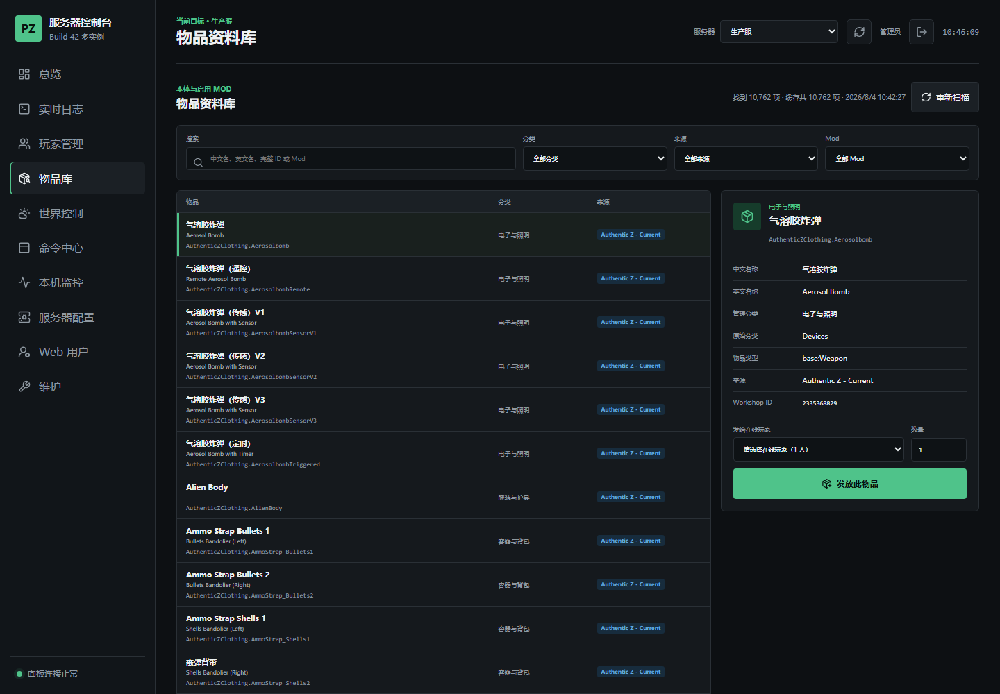
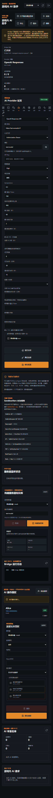
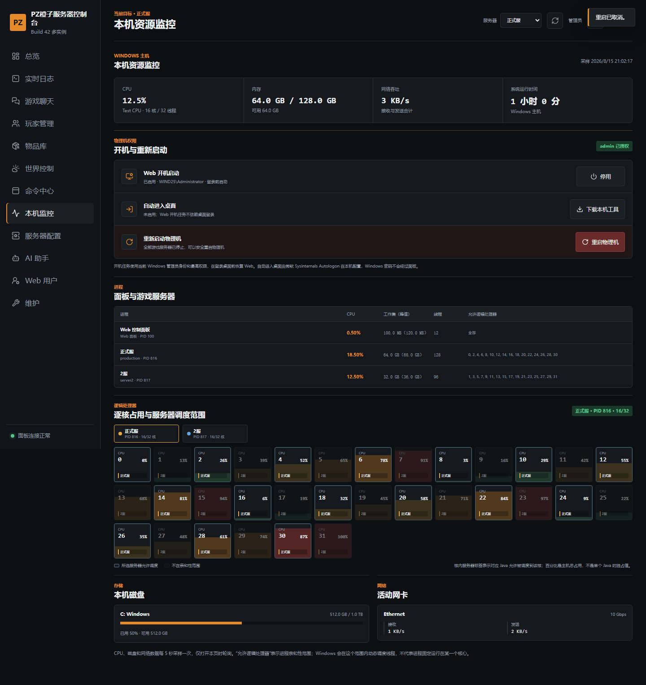
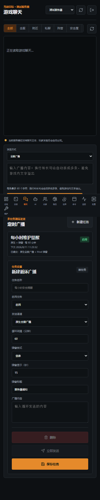

# PZ 橙子服务器控制台

面向 Project Zomboid Build 42 专用服务器的 Windows Web 控制台。发行包集成 Web
面板、只读 AI Bridge、服务器信息库、PZAIServerAgent 遥测诊断和受控生命周期脚本。

Steam 工坊只负责游戏内 Mod。服主端 Web 面板与 Bridge 应通过 GitHub Releases
或私有便携包安装，不应放入工坊 `mods` 目录。



## 主要功能

- 多服务器配置、状态查看、在线玩家、控制台日志与常用管理命令。
- 受控启动、保存、停止、安全重启和游戏服务端程序更新。
- 定时检查 Mod 更新；发现更新后可自动执行固定 60 秒安全重启流程。
- 每个服务器可独立设置原生自动保存、定时 ZIP 备份间隔和备份保留数量，并查看实际备份状态与空间占用。
- 重启前同时发送游戏原生广播与 PZWebNotices 右下角弹窗。
- 广播计划、物品搜索与发放、玩家权限、封禁、传送、天气和世界管理。
- 灾难与全服事件中心支持通用模板、立即启用、定时队列、运行状态和跨服独立调度。
- 按 SteamID64 查询关联账号与角色；管理员可安全改密，停服后可先备份再删除指定玩家数据。
- Java Agent 在服务端入口校验高风险客户端命令；Web 反作弊页以中文展示证据、管理员授权操作和原版反作弊信号，并支持跨服同步 SteamID 封禁名单。
- 独立 Java 补丁页展示 Agent 用途、目标类、风险边界、JAR 哈希、托管配置、当前 JVM 实际挂载和启动日志验证状态。
- 玩家审计可构建只读证据包并调用 AI 深度分析；一次性 PZAI 诊断仅作为辅助证据，不会自动封禁玩家。
- 管理员物品模板库可保存带附件与属性的物品快照并向不同服务器发放；选择性地图刷新可自动保护安全屋、人物和畜牧区，禁止重置区重复生成原版车辆，按需重建区域缓存，并支持完整备份与停服一键回滚。
- 物品批量发放逐玩家跟踪游戏日志结果，使用唯一提交 ID 防止页面重试造成重复发放。
- 页面断线或刷新后可恢复原提交状态；日志窗口没有明确结果时标记“待确认”，不把送达误报为成功。
- 执行历史按服务器记录，每页最多展示 30 条并支持翻页和分类筛选。
- Web 内置 AI Bridge，支持 DeepSeek、OpenAI Responses、OpenAI Chat 兼容接口和
  Anthropic Messages。
- 普通玩家只读查询服务器配置、SandboxVars、遥测和本地服务器信息库。
- Web 可从当前服务器配置、完整 SandboxVars、Mod/Workshop 清单构建脱敏知识库，并临时调用高推理模型生成字段解释和中文同义问法。
- AI 高频滥用与越权绕过审查，可保留相关会话，并联动踢出、广播与弹窗提醒。
- Web 用户、本地首次管理员初始化、审计日志和 Windows DPAPI 凭据加密。
- 同一 Web 端口提供独立 `/community/` 专属聊天页面，只开放三服名称切换、公开聊天、在线玩家和受限 Mod 弹窗；专属账号与管理账号、Cookie 和 API 完全隔离。
- Windows 或面板重启打断安全重启任务时，会核验真实进程与文件锁并自动恢复可启动状态。

## Java 补丁

仓库同时公开当前服务器使用的 Java Agent，包括反作弊、
ObjectModData 同步防护、玻璃附件死循环、容器循环、重复实体注册、尸体容器 ID、
联机长读条、动态贴图映射及选择性地图重置运行时防护。每个常驻补丁目录都含源码、测试、构建脚本和当前部署 JAR。

详细清单、构建方法、加载边界和 SHA-256 见 [Java Agent 说明](patches/README.zh-CN.md)。

## Claude CLI 日志诊断 Skill

[`skill/pz-server-log-diagnostics`](skill/pz-server-log-diagnostics/SKILL.md)
提供只读的 PZ 实例识别、当前启动窗口异常聚合、实时 CPU/内存与日志增量观察，并记录
SpriteConfig、ObjectModData、长读条、Java Agent 等已验证结论和排查误区。将该目录放入
`~/.claude/skills/` 后，可在 Claude Code 中使用 `/pz-server-log-diagnostics` 调用。

## 面板实机界面

以下图片由本机 Playwright 验收和实际面板生成，不是设计稿。截图中的测试服务器、测试
玩家与测试审查事件不随发行包发布。

## SteamID 玩家档案

“玩家管理”页可按 17 位 SteamID64 查询白名单账号、角色存档、权限、最近登录、在线状态、
允许列表和封禁状态。查询结果不会包含账号密码或数据库密码哈希。

Web 保留管理员 `admin` 可在服务器本机的“Web 用户”页给指定账号授予“玩家档案管理”权限。
授权账号可以查询 SteamID 档案、修改玩家密码和执行停服删除；历史旧账号默认没有该权限。
密码修改会先确认用户名确实属于目标 SteamID，再通过运行中的 PZ 官方 `setpassword` 命令
提交；密码不会写入 Web 执行历史或 API 回包。该授权不会同时授予物理机控制或 Web 用户管理
权限，授权开关本身仍只能由本机登录的 `admin` 修改。

永久删除只在目标服务器完全停止且没有停止、重启或更新任务时可用。面板会先备份账号库和
角色库，再删除该 SteamID 的白名单账号、角色与允许列表记录。封禁记录和 Web 审计日志保留，
避免删除账号时意外解封。数据库备份位于面板目录的 `backups/player-data`。

### 专属聊天页面

专属页面地址为 `http://服务器IP:8790/community/`。在服务器本机用 `admin` 登录原管理面板，
进入“Web 用户”页下方的“专属聊天访问账号”区域创建独立账号；该账号不能用于登录原管理页。

页面只返回正式服、2服和3服的名称、公开聊天与当前在线玩家。聊天范围限于全服、附近和服务器
广播，不返回私聊、阵营、安全屋频道或本机日志路径；玩家列表不返回 SteamID、历史账号和最近
登录信息。PZWebNotices 弹窗只能发送给当前服全部在线玩家或指定在线玩家，固定关闭原生广播，
并限制样式、时长、发送频率和审计内容。

### 物品资料库与批量发放



批量发放使用唯一提交 ID 防止网络重试造成重复发放。面板从命令提交时的日志游标开始按段
连续扫描游戏回执，即使命令与结果之间出现数 MB 高频日志也不会直接跳到文件尾；明确的成功
或失败结果会缓存，后续日志滚动不会让已确认状态重新变成等待。

### AI Bridge、只读边界与审查



### 物理机控制



### 手机布局



## 首次启动

1. 在 Windows 公网服务器上完整解压 ZIP，不要直接在压缩包内运行。
2. 双击 `一键启动Web面板.bat`。
3. Windows 弹出管理员授权时点击“是”，启动器会尝试开放默认 TCP 8790。
4. 在服务器本机打开 `http://127.0.0.1:8790/`。
5. 页面首次进入时创建 Web 面板 `admin` 管理员和强密码。

公开发行包不包含预设账号、密码、API Key、服务器路径、日志或玩家数据。第一个
Web 管理员只能从服务器本机 `127.0.0.1` 创建，不能通过公网地址抢先初始化。

Web 面板账号与 Project Zomboid 游戏内 `admin` 账号互不相同。

## 公网访问

默认地址为 `http://服务器公网IP:8790/`。

启动器只能管理 Windows 防火墙。云服务器还必须在云厂商安全组或入站规则中开放
同一个 TCP 端口。长期公网使用建议限制来源 IP，并在反向代理后启用 HTTPS。

需要换端口时双击 `修改面板端口.bat`。启动后可在 `手机访问地址.txt` 查看当前
局域网地址。

## 添加游戏服务器

首次启动会只读扫描正在运行的 Project Zomboid Dedicated Server Java 进程：

- 发现实例时，面板生成只读服务器配置。
- 未发现实例时，面板生成“待配置服务器”。

在“服务器配置”页面核对运行目录、数据目录、Java 路径、`serverName` 和端口。
需要由面板执行启动、停止、保存、广播、安全重启和更新计划时，将命令通道改为
“受控命令队列”，并让面板生成托管启动脚本。

同一台物理机上的多个 PZ 服务器可能共用 Steam Workshop 安装目录。面板会自动串行化
启动流程：第一台完成 Steam、Workshop、Mod 和网络初始化并写出标准服务器就绪标记后，
第二台才会创建 Java 进程。服务器条会分别显示“排队启动”“初始化中”和“运行中”，
避免同步重启时两个实例同时修改 Workshop 文件。

## 自动保存与备份

“维护中心”会直接读取所选服务器 INI 中的 Project Zomboid 原生参数：

- `SaveWorldEveryMinutes`：自动保存世界的分钟间隔，关闭时为 `0`。
- `BackupsPeriod`：生成定时 ZIP 备份的分钟间隔，关闭时为 `0`。
- `BackupsCount`：定时备份保留份数，旧备份由游戏服务器自动轮换。

每个服务器配置和备份目录相互独立。运行中的受控服务器保存设置后，会同步提交在线
`changeoption`；INI 无论是否在线都会持久化，并在下次启动时完整生效。面板只读取
`数据目录\backups\period` 的状态，不会自行复制运行中的世界文件。

## Mod 更新计划

在“维护中心”可以为每个服务器设置自动检查间隔，并选择：

- 只检查和通知，由管理员决定何时重启。
- 发现 Mod 更新后自动安全重启。

启用自动重启后，检测到更新会立即提交以下固定流程：

1. 发送游戏原生全服广播。
2. 若 PZWebNotices 在线，同时发送右下角弹窗。
3. 等待 60 秒，让在线玩家保存状态并做好下线准备。
4. 保存世界并正常退出游戏服务器。
5. 重新启动同一服务器实例。
6. 将检查结果、通知状态和生命周期操作写入执行历史。

自动重启要求服务器已经使用受控命令队列，并具备可用的托管重启脚本。首次安装、
删除或更新 Mod 后仍建议管理员观察一次完整重启，确认 Mod 列表和存档正常。

## 游戏内 AI

游戏服务器至少安装：

```ini
WorkshopItems=3777330954
Mods=PZAIServerAgent
```

右下角弹窗和继续提问输入框为可选联动：

```ini
WorkshopItems=3777409029
Mods=PZWebNotices
```

AI Bridge 已集成在 Web 面板进程内，无需单独启动。配置步骤：

1. 在服务器本机登录面板并进入“AI 助手”。
2. 选择 Provider，填写接口根地址、认证方式和模型 ID。
3. 填写 API Key，选择安装了 PZAIServerAgent 的服务器。
4. 点击“测试连接”，成功后启用并保存。

API Key 保存到 `ai-credential.dat`，并由 Windows DPAPI 按当前电脑和当前 Windows
用户加密。迁移到新电脑或换 Windows 用户后必须重新填写。

## DeepSeek 官方示例

在面板中使用：

```text
Provider：OpenAI Chat Completions
接口地址：https://api.deepseek.com
认证方式：Bearer
模型：以“查询模型”返回和账号实际可用 ID 为准
```

不要把 API Key 写入 `ai-config.json`、知识库、说明文件、聊天或 Git 仓库。

## 只读边界与证据

普通玩家可查询当前服务器只读配置、SandboxVars、PZAIServerAgent 遥测和
`服务器信息库`。AI 没有 Shell、PowerShell、Lua、RCON、发物品、改配置、封禁或
重启权限。

涉及“本服当前设置”的回答遵循：

1. 当前服务器只读配置和实时遥测优先。
2. `服务器信息库`作为补充。
3. 一般游戏知识只能解释机制，不能冒充本服实际设置。

没有本服证据时，AI 应明确回答无法确认。知识库文件会进入玩家问答上下文，因此
不得存放密码、密钥、玩家隐私或不希望普通玩家得知的信息。

## 审查与滥用

Bridge 保留有限会话记忆，并对高频请求、越权诱导、提示词绕过和敏感信息探测进行
审查。达到处罚规则时，可通过受管服务器通道踢出玩家，并记录审查事件、保留相关
会话、发送全服广播和 PZWebNotices 弹窗。

处罚属于确定性规则联动，不依赖模型自行决定。服主应先在测试服验证踢出、广播和
弹窗通道，再用于正式服。

审查记录在 Web 的“AI 审查名单”中单独展示。默认保留期为 30 天，便于管理员复核
触发规则、玩家输入、处罚结果和相关会话，不需要翻找普通执行日志。

## 知识库

面板内可直接打开本地 `服务器信息库`。支持 `md`、`txt`、`json`、`ini`、`cfg`、
`lua`、`yaml`、`yml`、`csv`。

公开包只带空白模板，不带作者私服资料。建议按“服务器规则”“Mod 用法”“活动”
“常见问题”拆分文件，并写明适用服务器、日期、Workshop ID 和标准回答。

在 AI 助手页点击“构建服务器知识库”时，面板会先在隐藏临时目录中执行本机只读解析，
过滤密码、RCON、Token、API Key、SteamID 和绝对路径，并校验每个 SandboxVars 字段都已
进入索引。之后才会把脱敏资料分批发送给选定模型。模型输出不能新增输入中不存在的
SandboxVars 路径，全部批次成功后才替换 `自动生成` 目录。

构建模型和推理强度只影响本次知识库任务，不修改日常玩家问答模型。推荐使用 `Auto`：
DeepSeek、Flash、Turbo、Nano 类模型自动使用 Low，避免推理 token 吃完输出预算；其他 Responses
模型使用 Medium。也可以手工选择 Low、Medium 或 High。官方 `api.deepseek.com` 当前可在
Chat Completions 路由调用 `deepseek-v4-pro`，但 Responses 路由会返回尚未开放；面板只在本次
V4 Pro 知识库构建中自动使用 Chat 路由并传递所选推理强度，不修改日常回答 Provider。
其他兼容 Provider 若返回特定“请使用 Flash”错误，任务会改用 `deepseek-v4-flash + Low`
重试当前批次。构建状态与报告始终记录最终实际模型和接口类型。

模型增强只负责字段语义、中文同义问法和 Mod 定位，不是本服当前值的权威来源。玩家
问答仍按“实时只读配置 > 自动知识库与外部手工资料 > 一般知识”取证。手工文件放在
`服务器信息库` 上级目录即可，自动构建不会覆盖这些文件。

## 更新与备份

升级前备份当前目录。覆盖程序文件时保留自己的：

```text
users.json
servers.json
ai-config.json
ai-credential.dat
服务器信息库
```

不要用其他电脑生成的 `ai-credential.dat` 覆盖本机凭据。首次安装或更新游戏 Mod
后，应完整停止并重启游戏服务器。

## 发行包隐私

公开构建脚本使用白名单复制，并拒绝打包运行态配置、凭据、日志、历史、计划、玩家
数据、当前知识库和本机绝对路径。发布 ZIP 时同时提供 `.sha256.txt` 供服主校验。

Node.js 运行时许可证位于 `runtime/NODE-LICENSE.txt`。

## 许可证

当前仓库未附带开源许可证。源码可供审阅和部署测试，但复制、修改或再发布前应先取得
仓库所有者许可。
